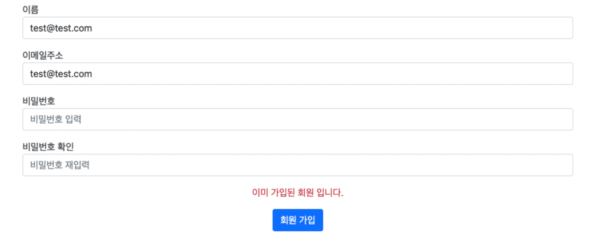
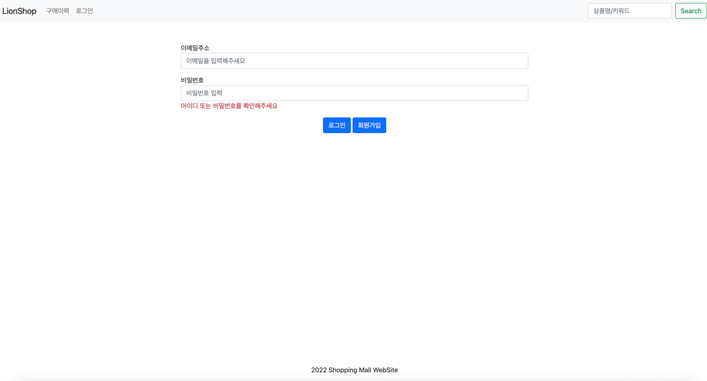

# 1주차 : 쇼핑몰 프로젝트 기본 구조 구성 및 인증/인가 구현

## 주의사항

```
[공지] 자료 유출에 대한 알림

녹화 및 유포, 복제 등이 발생하는 경우 본 익스턴십 참여부터, 관련된 모든 법적제재의 대상이 될 수 있으므로 본 자료는 과제수행용으로만 이용 가능 하시다는 것 유념 부탁드리겠습니다.

감사합니다.
```

## 환경, 사용언어 및 라이브러리
- JDK 11
- IDE : 인텔리제이 (IntelliJ)
- build tool : gradle
- MariaDB
- Spring Boot 2.6.x
- Spring Data JPA
- Spring Security
- Thymeleaf
- 데이터베이스 접근 툴 : DBeaver

## build.gradle
```
dependencies {
    implementation 'org.springframework.boot:spring-boot-starter-data-jpa'
    implementation 'org.springframework.boot:spring-boot-starter-thymeleaf'
    implementation 'org.springframework.boot:spring-boot-starter-validation'
    implementation 'org.springframework.boot:spring-boot-starter-web'
    implementation 'org.springframework.boot:spring-boot-starter-security'
    implementation 'nz.net.ultraq.thymeleaf:thymeleaf-layout-dialect:3.0.0'
    implementation 'org.thymeleaf.extras:thymeleaf-extras-java8time:3.0.4.RELEASE'
    implementation 'org.thymeleaf.extras:thymeleaf-extras-springsecurity5'
    implementation 'org.mariadb.jdbc:mariadb-java-client:3.0.3'

    compileOnly 'org.projectlombok:lombok'
    runtimeOnly 'com.h2database:h2'
    annotationProcessor 'org.projectlombok:lombok'
    testImplementation 'org.springframework.boot:spring-boot-starter-test'
}
```

- **spring-boot-starter-data-jpa** : JPA를 쉽게 구현할 수 있도록 도와주는 모듈
- **spring-boot-starter-thymeleaf** : 서버에서 가공한 데이터를 뷰에 보여주기 위한 템플릿 엔진
- **spring-boot-starter-validation** : Java Bean 유효성 검사를 사용하기 위한 스타터
- **spring-boot-starter-web** : Spring MVC 기반의 웹 애플리케이션 개발을 위한 스타터
- **spring-boot-starter-security** : 인증 및 인가 처리를 위한 프레임워크. **의존성 추가 시 모든 요청은 인증을 필요로함. 이 라이브러리 같은 경우는 초기 세팅에는 추가를 하지 않았으므로 로그인/회원가입 구현 때 직접 추가해주세요!**
- **thymeleaf-layout-dialect** : thymeleaf를 이용하여 하나의 레이아웃을 여러 페이지에 똑같이 적용할 수  있도록 도와주는 라이브러리
- **thymeleaf-extras-java8time** : thymeleaf에서 자바8에서 추가된 LocalDate, LocalDateTime 처리를 도와주는 라이브러리
- **thymeleaf-extras-springsecurity5** : thymeleaf와 spring security를 통합한 모듈로 인증여부, 사용자의 ROLE에 따라서 화면 노출 제어를 도와줌
- **mariadb-java-client** : MariaDB에 접근하기 위한 라이브러리
- **lombok** : Getter/Setter, ToString 과 같은 반복적인 자바 코드를 컴파일 할 때 자동으로 생성해주는 라이브러리
- **spring-boot-starter-test** : 스프링 부트 애플리케이션 테스트를 위한 JUnit이나 Mockito 같은 테스트 프레임워크 포함
- **H2 Database** : 자바 기반의 관계형 데이터베이스로 매우 가볍고 빠른 데이터베이스. 메모리 내에 데이터를 저장하는 인메모리 데이터베이스 기능 지원. 테스트용 데이터베이스로 많이 사용


## 학습 목표
- Thymeleaf를 이용한 서버 사이드 렌더링 처리
- 공통 영역 처리 및 레이아웃에 대한 이해 (layout, navigation bar, footer)
- 패키지 구조 설계 방법
- application.yml 을 이용하여 애플리케이션 설정 세팅 및 환경별 구성 이해
- 스프링 시큐리티를 이용하여 회원 가입 및 로그인, 로그아웃 기능 구현
- Spring Data JPA 기본 사용법
- 입력값에 대한 검증 (spring-boot-starter-validation 사용)


## 테이블
| 테이블명 | 컬럼명 | 컬럼 설명 |
| --- | --- | --- |
| member | member_id | 회원 아이디 |
|  | create_time | 생성 시간 |
|  | update_time | 수정 시간 |
|  | created_by | 생성자 |
|  | modified_by | 수정자 |
|  | email | 이메일 |
|  | member_name | 회원 이름 |
|  | member_type | 회원 타입 |
|  | password | 비밀번호 |
|  | refresh_token | 토큰 기반 인증 시 사용할 리프레시 토큰 저장 컬럼 |
|  | role | 회원 권한 |
|  | token_expiration_time | 토큰 만료 시간 |

- member_type : GENERAL 저장 (일반 회원)
- refresh_token, token_expiration_time : null 저장
- ROLE : USER or ADMIN 저장

## 미션
- application.yml profile별로 생성(default, dev, prod, test) 및 데이터베이스 연결
    - MariaDB 설치 및 shop 이름의 데이터 베이스 생성
    - default, dev, prod 환경의 경우 설치한 MariaDB 연결
    - test 환경의 경우 h2 데이터베이스 연결
- 네비게이션바와 푸터 쇼핑몰 공통 레이아웃 생성 (layout, header, footer)
    - Thymeleaf fragment 기능 , Thymeleaf Layout Dialect 사용
- 회원 가입 기능 구현
- 로그인 기능 구현
- 로그 아웃 기능 구현


## 기능 구현 요구 사항
1. 메인 페이지 접근 시 navigation bar 영역, 본문 영역, footer 영역으로 나눠서 다음과 같은 페이지 출력
   페이지마다 달라지는 본문 영역만 바꿀 수 있도록 레이아웃 공통화 기능 적용


2. 회원 가입 기능 구현 
 - 레이아웃 공통화 적용
 - 회원 정보 입력 후 회원 가입 성공 시 로그인 페이지로 이동

 - 동일한 이메일로 가입 시도 시 에러 메세지 화면 출력

 - 필수 입력 값 및 validation 조건을 통과 못할 경우 에러 메세지 화면 출력

 - 비밀번호, 비밀번호 확인 값이 다를 경우


3. 로그인 기능 구현
 - 레이아웃 공통화 적용
 - 이메일과 비밀번호 입력 후 로그인 성공 시 메인 페이지로 이동
 - 회원 가입 버튼 클릭 시 회원 가입 페이지로 이동


 - 로그인 실패 시 실패 사유 화면에 출력


4. 로그인 / 로그아웃 노출
 - 로그인 성공 시 navigationbar 에 “로그인" 대신 “로그아웃" 메뉴 활성화
 - 로그아웃 버튼 클릭 시 로그아웃 기능 동작. 이때는 다시 로그인 메뉴 활성화


## 평가 기준
 